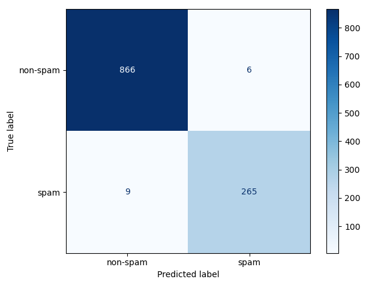

# Spam-Detector

## Data Pipeline 

Credit to Kaggle User jackksoncsie for the Spam Email dataset that I used for my classifier. 

Data follows the following pipeline from csv to training. Data is first split into subject and body, then using the Universal Sentence Encoder (From `tensorflow_hub`), I encoded each row from the csv into 64 bit floating point vectors. These vectors are L2 normalized, then shuffled in order. Using scikit-learn I partition the full dataset into training and test samples, 80% of the dataset is set aside for training samples and the other 20% are set aside for test samples, all while maintaining class balance. 

## Model Architecture 

I use the Universal Sentence Encoder, a pretrained model provided by `tensorflow_hub` to encode data, providing a deep learning backbone to how we extract numeric values from each email. The most up to date model is an SVM using the RBF kernel. I optimize hyperparameters over a random search, then using the best parameters from that search, I perform a grid search around those values. This model is stored and at inference, it pulled back up, makes predictions on the test samples, and records metrics about the model to showcase efficacy. 

## Usage 

Using the emails.csv file (Or any other dataset that is formatted similarly),
+ `text_encoding.py`: Cleans and encodes the dataset to `.npz` training and test files. 
+ `svm.py`: Trains model and saves best hyperparameters on `training_samples`. 
+ `inference.py`: Performs inferences on `test_samples` and provides performance metrics. 

## Future Plans 

I plan on creating a pipeline to read a faux input stream of emails and perform real-time classification of emails. This requires a more robust formatting that works off of the pure html format. Additionally it might require a more robust way of handling larger emails as the token context of USE-4 might not be sufficient. 

## Metrics and Confusion Matrix for Current Best Model

Performance metrics from most recent model,

|class|precision|recall|f1|support|
|---|---|---|---|---|
|non-spam|0.990|0.993|0.991|872|
|spam|0.978|0.967|0.972|274|
|accuracy|||0.987|1146|
|macro avg|0.984|0.980|0.982|1146|
|weighted avg|0.987|0.987|0.987|1146|

This table essentially shows that the model has a low false positive rate, while having a high true positive rate (and low false negative rate). Overall, the model has an accuracy of 98.7% on the training samples. The corrsponding Confusion Matrix,

